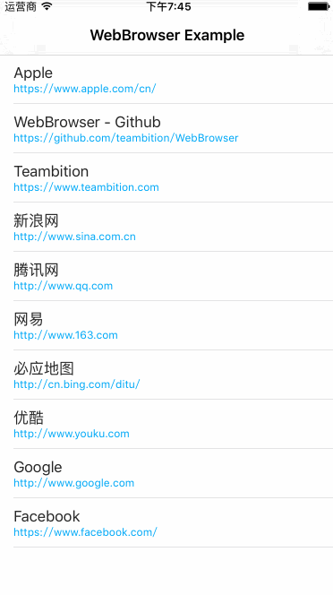

# WebBrowser
A web browser using WebKit and written in Swift for iOS apps.



## How To Get Started
### Carthage
Specify "WebBrowser" in your ```Cartfile```:
```ogdl 
github "teambition/WebBrowser"
```

### CocoaPods
Specify "WebBrowser" in your ```Podfile```:
```ruby 
source 'https://github.com/CocoaPods/Specs.git'
platform :ios, '8.0'
use_frameworks!

pod 'WebBrowser'
```

### Usage
#### Initialization
```swift
let webBrowserViewController = WebBrowserViewController()
// assign delegate
webBrowserViewController.delegate = self

webBrowserViewController.language = .english
webBrowserViewController.tintColor = ...
webBrowserViewController.barTintColor = ...
webBrowserViewController.isToolbarHidden = false
webBrowserViewController.isShowActionBarButton = true
webBrowserViewController.toolbarItemSpace = 50
webBrowserViewController.isShowURLInNavigationBarWhenLoading = true
webBrowserViewController.isShowPageTitleInNavigationBar = true
webBrowserViewController.customApplicationActivities = ...

webBrowserViewController.loadURLString("https://www.apple.com/cn/")
```

#### Pushing to the navigation stack
```swift
navigationController?.pushViewController(webBrowserViewController, animated: true)
```

#### Presenting modally
```swift
let navigationWebBrowser = WebBrowserViewController.rootNavigationWebBrowser(webBrowser: webBrowserViewController)
present(navigationWebBrowser, animated: true, completion: nil)
```

####  Implement the delegate
```swift
func webBrowser(_ webBrowser: WebBrowserViewController, didStartLoad url: URL?) {
    // do something
}

func webBrowser(_ webBrowser: WebBrowserViewController, didFinishLoad url: URL?) {
    // do something
}

func webBrowser(_ webBrowser: WebBrowserViewController, didFailLoad url: URL?, withError error: Error) {
    // do something
}

func webBrowserWillDismiss(_ webBrowser: WebBrowserViewController) {
    // do something
}

func webBrowserDidDismiss(_ webBrowser: WebBrowserViewController) {
    // do something
}
```

## Minimum Requirement
iOS 8.0

## Localization
WebBrowser supports 5 languages: English, Simplified Chinese, Traditional Chinese, Korean, Japanese. You can set the language when initialization.

## Release Notes
* [Release Notes](https://github.com/teambition/WebBrowser/releases)

## License
WebBrowser is released under the MIT license. See [LICENSE](https://github.com/teambition/WebBrowser/blob/master/LICENSE.md) for details.

## More Info
Have a question? Please [open an issue](https://github.com/teambition/WebBrowser/issues/new)!
